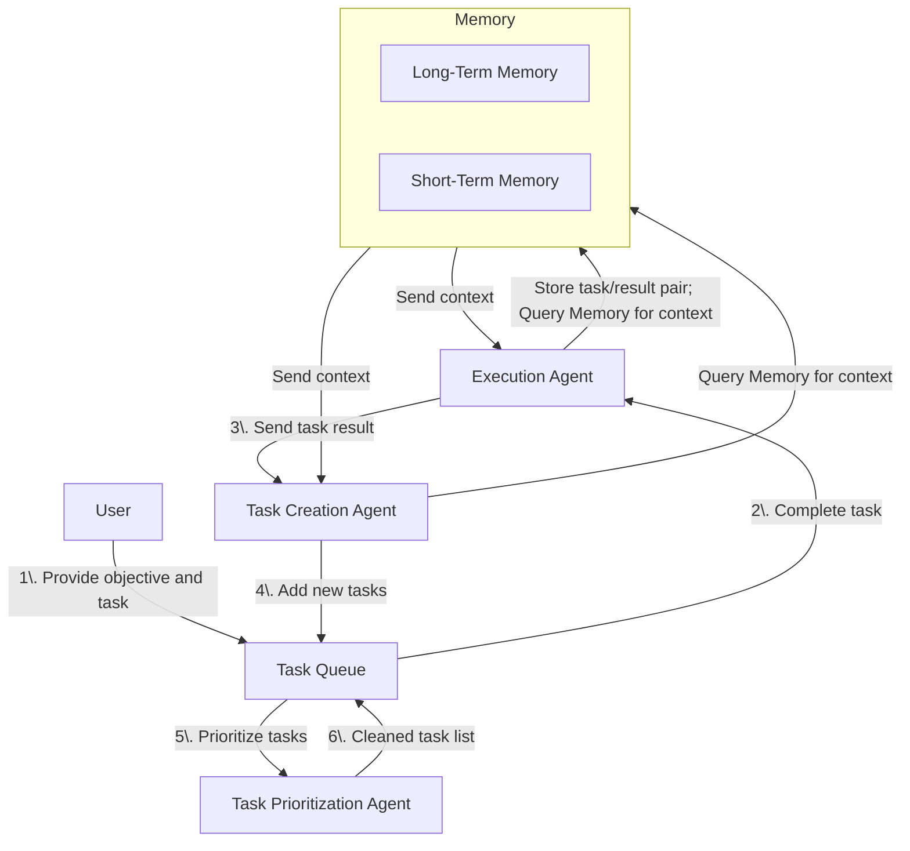

The main reference of this writing is [AI Agents vs. Agentic AI: A Conceptual Taxonomy, Applications and Challenges](https://arxiv.org/pdf/2505.10468).

>**AI Agents** are modular systems driven and enabled by large-scale generative models for task-specific automation. **Agentic AI systems** are those that adopt multi-agent collaboration, dynamic task composition, persistent memory, and coordinated autonomy.
{: .prompt-tip }

## Before AI Agents and Agentic AI
The development of autonomous and intelligent agents were multi-agent systems (MAS) and expert systems, which are a part of foundational paradigms of AI. These systems mimic the decision-making ability of a human expert. An example of an expert system (rule-based) in the 1970s is MYCIN, developed to diagnose bacterial infections. It was never deployed in real hospitals, but it demonstrated how expert systems could be used to assist doctors towards accurate diagnoses.

{: width="448" height="448" }
_Rule-Based Expert Systems: The MYCIN Experiments of the Stanford Heuristic Programming Project (Reprinted 1984). Taken from [this story published by Forbes](https://www.forbes.com/sites/gilpress/2020/04/27/12-ai-milestones-4-mycin-an-expert-system-for-infectious-disease-therapy/)._

Then emerged **distributed intelligence** where individual agents' actions and cognitive processes in a shared environment are coordinated to achieve a primary goal. **Goal delegation** formed the basis for organizational behavior. From distributed intelligence sprouted [**sociality (social action) for AI Agents**](https://www.ijcai.org/Proceedings/97-2/Papers/116.pdf), where the term "AI Agent" was first used in 1998. Another study provided a [comprehensive framework for MAS](https://dl.acm.org/doi/book/10.5555/520715), which characterized agents as entities with **autonomy**, **perception**, and **communication abilities**. Up to this day, these characteristics are <u>strict requirements in an autonomous software architecture</u>, and I experienced building one firsthand while working on my Capstone Project.

These early studies laid the groundwork and set the stage for what we now refer to as AI Agents and Agentic AI systems. They underscored that **task delegation (distributed intelligence) and cognitive architectures (agent design) are fundamental to modeling collective phenomena (sociality).** A good example of sociality (but this time for humans) is depicted in the figure below. It illustrates the knowledge acquisition process for expert systems in the 1980s, demonstrating how knowledge bases were developed back then. It was a highly labor-intensive process that relied on expensive specialists. One primary method involved a **knowledge engineer** who would directly interview a **subject matter expert** to manually translate their expertise into a format the knowledge base system could understand. In parallel, a **computational linguist** worked on a more automated approach; they designed natural language tools that attempted to read documents, such as clerk's transcription of a doctor's handwritten notes, and automatically extract that information into the same structured knowledge base.

_How was a knowledge base being developed for Expert Systems? In the 1980s, the figure above shows one of the standard (now archaic) approaches to knowledge acquisition and natural language processing. Taken from [Architectures of Intelligent Systems, 2002](https://www.jfsowa.com/pubs/arch.htm)._

Nowadays, subject matter experts are employed to correctly annotate data for training AI models often with the help of AI-assisted tools, as opposed to being directly interviewed by a knowledge engineer. Some approaches even use another specialist AI model and pose it as a synthetic subject matter expert in place of a human expert.

The limitation of classical agent-like systems is that they were designed for specific tasks with predefined rules; hence, limiting their autonomy and adaptability to new tasks. In contrast to modern AI agents, they were primarily reactive that relied on symbolic reasoning, rule-based logic, and scripted behaviors rather than learning from experience (experiential learner) and being context-aware. To sum it up, **early AI agents** have the following limitations: **they lacked self-learning, generative reasoning, and adaptability to evolving environments.**

## Forward to Today (post ChatGPT release in 2022)
Following the emergence of LLMs and large-scale generative models in late 2022, there has been a surge of interest in AI Agents and Agentic AI systems. Only this time, the newer generation of AI agents are built to counter the mentioned limitations above. These agents are learning-driven and designed based on adaptive architectures. See: [Why Do Multi-Agent LLM Systems Fail?](https://arxiv.org/pdf/2503.13657), [AI Agents and Agentic Systems: A Multi-Expert Analysis](https://www.tandfonline.com/doi/full/10.1080/08874417.2025.2483832), and [Agentic AI For Scientific Discovery: A Survey of Progress, Challenges, and Future Directions](https://arxiv.org/pdf/2503.08979v1).

The global success of ChatGPT popularized **Generative Agents**, which are LLM-based systems designed to generate various forms of output (i.e. text, images, code) given a set of instructions or prompts from a user. One good example is [GitHub Copilot](https://github.com/copilot). I remember using GitHub Copilot back then (when it had no access to tools) to help me write boiler plate code for my projects. All I did was to provide a prompt (e.g. "Create a Python class for data crawling") and it would generate the code for me. It outputs good quality code because a role or behavior is assigned to it. Now, it's more of an AI agent rather than a Generative Agent because it can use custom tools (i.e. tailored to ease the code development process, such as pushing code to GitHub).

The term "AI Agent" evolved significantly with the rise of generative AI. The new class of AI agents enhanced LLMs with capabilities for external tool use (e.g. API-based tools), function calling, and chain-of-thought reasoning. These "next-gen" AI agents actively showcased how LLMs, when integrated into feedback loops, can dynamically plan, execute, and adapt in changing environments. Example: [BabyAGI](https://github.com/yoheinakajima/babyagi).

  Figure 1: BabyAGI autonomous software architecture.

By late 2023, Agentic AI systems emerged as a more complex collaboration of multiple AI agents, each with specialized roles that collectively decompose a primary goal into sub-goals (that are easily manageable by each agent). Based on my personal experience, whenever I build an agentic-driven app, I always start with a **goal decomposition** process. From a complex, vague goal, I work my way down to simple, specific sub-goals. Then, I create **roles** for each agent that will be responsible for achieving each sub-goal. Lastly, I design the **communication protocols** between agents via **hand-offs**. Recently, Google announced [**Agent-to-Agent (A2A) Protocol**](https://developers.googleblog.com/en/a2a-a-new-era-of-agent-interoperability/), a proposed standard developed for AI agent interoperability across different frameworks and vendors. This protocol is built around five core principles: **embracing agentic capabilities**, **building on existing standards**, **securing interactions by default**, **supporting long-running tasks**, and **ensuring modality agnosticism**. I have to agree that these core principles are essential for a responsive and scalable agentic system.



Today, **AI Agents** and **Agentic AI systems** can be characterized as follows:
- **AI Agents**: Typically designed as single-entity systems that perform goal-directed tasks by utilizing external tools, applying chain-of-thought reasoning, and integrating real-time information to complete well-defined functions. This highlights: **autonomy (minimal human intervention)**, **task-specificity (narrow, well-defined tasks)**, and **reactivity (responding to changes)**.
- **Agentic AI systems**: Composed of multiple, specialized agents that coordinate, communicate, and dynamically allocate sub-tasks within a broader workflow to achieve a common goal.

I also need to highlight **Generative Agents**, which are hybrid systems that blend generative modeling with modular task specialization. They inherit LLM-centric pretraining capabilites and excel in producing multimodal content creation, yet they lack the proactive orchestration and state persistence of Agentic AI systems.

Here's a table (from the main reference) that I think concisely compares the four technologies starting with Generative AI (baseline) to Generative Agents, then to tool-augmented AI Agents, and finally to collaborative Agentic AI systems. We see a trend here **from passive content generation to interactive task execution and finally to autonomous, multi-agent orchestration**.

  Table 1: Comparison of Generative AI, Generative Agents, AI Agents, and Agentic AI.

| Feature/Mechanism    | Generative AI                                 | Generative Agent                                                | AI Agent                                                              | Agentic AI                                                                             |
| -------------------- | --------------------------------------------- | --------------------------------------------------------------- | --------------------------------------------------------------------- | -------------------------------------------------------------------------------------- |
| Core Function        | Content generation                            | Simulated human-like behavior                                   | Task-specific execution using tools                                   | Complex workflow automation                                                            |
| Mechanism            | Prompt $\rightarrow$ LLM $\rightarrow$ Output | Prompt $\rightarrow$ LLM + Memory/Planning $\rightarrow$ Output | Prompt $\rightarrow$ Tool Call $\rightarrow$ LLM $\rightarrow$ Output | Goal $\rightarrow$ Agent Orchestra $\rightarrow$ Output                                |
| Structure            | Single model                                  | LLM + memory + behavior model                                   | LLM + tool(s)                                                         | Multi-agent system                                                                     |
| External Data Access | None (unless added)                           | Typically closed-world (simulated inputs)                       | Via external APIs                                                     | Coordinated multi-agent access                                                         |
| Key Trait            | Reactivity                                    | Autonomy                                                        | Tool use                                                              | Collaboration                                                                          |
| Primary Driver       | Reactivity to prompt                          | Reactivity to input or sub-task prompt                          | Tool calling for task execution                                       | Inter-agent communication and collaboration                                            |
| Interaction Mode     | User $\rightarrow$ LLM                        | System/Agent $\rightarrow$ Agent $\rightarrow$ Output           | User $\rightarrow$ Agent $\rightarrow$ Tool                           | User $\rightarrow$ Multi-Agent System $\rightarrow$ Agents                             |
| Workflow Handling    | Single generation handling                    | Single step within workflow                                     | Single task execution                                                 | Multi-step workflow coordination                                                       |
| Information Flow     | Input $\rightarrow$ Output                    | Input (from System/Agent) $\rightarrow$ Output                  | Input $\rightarrow$ Tool $\rightarrow$ Output                         | Input $\rightarrow$ Agent1 $\rightarrow$ Agent2 $\rightarrow$ ... $\rightarrow$ Output |
| Task Scope           | Single piece of generated content             | Specific sub-task (often generative)                            | Single, specific, defined task                                        | Complex, multi-faceted goal or workflow                                                |
| Example (Video)      | Chatbot                                       | YouTube Title/Description/Summary Generator                     | Tavily Search Agent (see GIF below)                                   | YouTube-to-Blog Converter                                                              |
| -------------------- | --------------------------------------------- | --------------------------------------------------------------- | --------------------------------------------------------------------- | -------------------------------------------------------------------------------------- |

_The Tavily Search Agent is an AI agent that enables LLMs to perform web searches and retrieve real-time information via search tool._

You know, it's pretty wild how much chatbots like [ChatGPT](https://openai.com/chatgpt/overview/) and [Gemini](https://deepmind.google/models/gemini/) have changed lately. I've noticed they're not just spitting out text anymore; they can actually use tools, call up functions, and even do some pretty impressive reasoning.

Now, here's where I think we might need to adjust our thinking. When we talk about AI agents, it feels a bit off to lump these general-purpose chatbots in with the highly specialized ones. Why? Well, think about it: you can ask ChatGPT to check your math, then have it write a poem, and in the same breath, get it to generate some hyperrealistic images. All in one go!

To me, that makes them something special: **generalist conversational AI agents**. They're "generalist" because they're not stuck doing just one thing, and "conversational" because, well, you talk to them. They need us to give them a prompt or tell them if their output hit the mark.

I really believe we should define these generalist conversational AI agents as their own distinct class. They're clearly different from those more specialized AI agents built for super specific tasks or domains. It's an important distinction to make as AI keeps evolving!



Therefore, a generalist AI agent (**in my humble opinion**) is, at its core, a single intelligence (entity) engineered to execute nearly (virtually) any task or function. This is accomplished by building upon a foundation of general knowledge and emergent capabilities from pretraining, then adapting to preferred behaviors through fine-tuning, and critically, possessing the autonomy to determine if and when external tools are necessary.

Shown below is [*Helix*](https://www.figure.ai/news/helix), a **humanoid generalist AI agent** powered by [Figure AI](https://www.figure.ai/about-us)'s pretrained vision-language-action (VLA) model, which can perform a wide range of tasks, from picking up objects to household chores.







## Why do we need to differentiate AI Agents and Agentic AI?
1. Enables more precise system design by aligning computational frameworks with problem complexity ensuring that **AI Agents are deployed for modular, tool-assisted tasks**, while **Agentic AI** is employed for orchestrated multi-agent operations.
2. **Allows for appropriate benchmarking and evaluation**. Performance metrics, safety protocols, and resource requirements differ significantly between single-agent and multi-agent systems. Understanding these distinctions helps in setting realistic expectations and standards for each type of system.
3. **Reduces development inefficiencies** by preventing the misapplication of design principles. For instance, using Agentic AI frameworks for simple tasks can lead to unnecessary complexity, while applying single-agent architectures to complex workflows can result in bottlenecks and inefficiencies.

## Conclusion
The leap from individual AI Agents handling single tasks to Agentic AI systems where agents collaborate on big projects marks a huge shift in what AI can achieve. Knowing the difference is key because it’s really about using the right tool for the job, ensuring we build smarter solutions without overcomplicating things. Ultimately, this understanding paves the way for creating truly autonomous systems that can tackle the messy, complex challenges of the real world.
