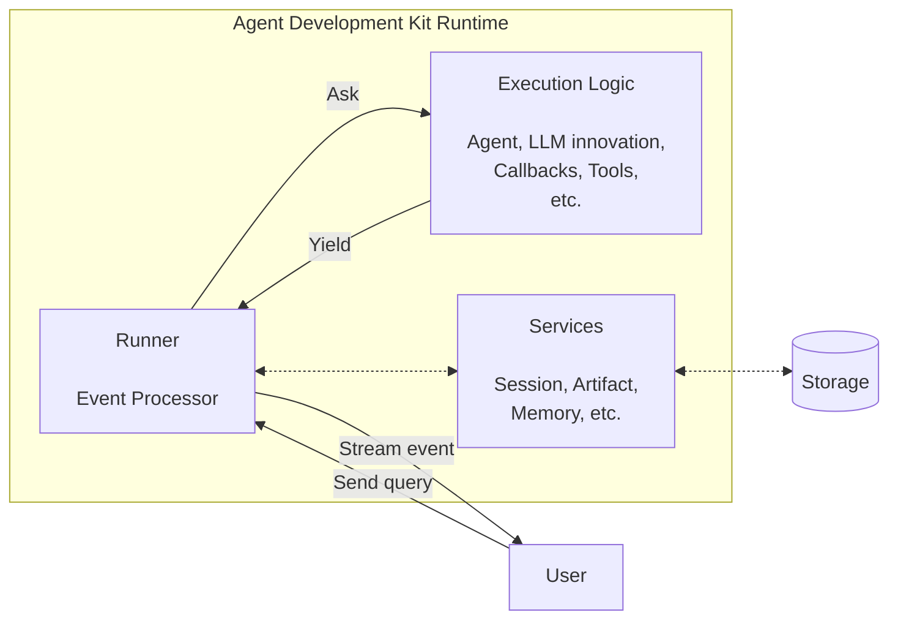

>**Ollama** runs lightweight Large Language Models (LLMs) or Small Language Models (SLMs) locally with ease. **Tavily Search** provides real-time, accurate web results for AI agents. The **Google Agent Development Kit (ADK)** is a comprehensive framework for building and deploying AI agents.
{: .prompt-tip }

## Steps to Build the Agent
1. **Install Ollama**. Access the [Ollama](https://ollama.com/) website. Installation is straightforward.
2. **Choose a Model**. We will use the Qwen3-1.7B model because it is parameter-efficient yet capable of tool-calling. To download the model, run the following command in your terminal:
   ```bash
   ollama pull qwen3:1.7b
   ```
3. **Get Tavily Search API Key**. Sign up at [Tavily](https://www.tavily.com/) to obtain an API key. The free tier (*Researcher Plan*) allows up to 1000 queries per month.
4. **Export the API Key**: Set the environment variable for the Tavily API key:
   ```bash
   export TAVILY_API_KEY=your_tavily_api_key
   ```
5. **Create the Agent**. Use the Google ADK to create an agent that utilizes the Qwen3-1.7B model and Tavily Search.

The five steps above are all we need to do to set up the agent. In the following sections, we first need to understand the core concepts of Google ADK, and then we will create the agent using the Google ADK. Before we proceed, make sure you have an Integrated Development Environment (IDE) like Visual Studio Code or PyCharm and Python 3.10 or later installed on your computer for the actual coding part.

## Core Concepts of Google ADK
* **Models**. The underlying LLMs or SLMs that powers agents, enabling their reasoning, decision-making, and interaction capabilities.
* **Agent**. The fundamental worker unit designed for specific tasks. Agents can use language models for complex reasoning or act as deterministic controllers of the execution.
* **Tool**. Extends the capabilities of agents beyond conversation, allowing them to interact with external APIs, search information, run code, or call other services.
* **Session**. Represents the context of a single conversation, including its history and the agent's working memory (e.g., previous interactions injected into the context window).
* **Memory**. Allows agents to recall information across about a user across multiple sessions, providing long-term context.
* **Event**. Represents occurrences within a session (e.g., user messages, tool calls, or system events), forming the conversation history.
* **Runner**. Manages the execution flow, orchestrates agent interactions based on events, and coordinates with backend services.

Some concepts that are out of scope of this writing but are worth mentioning:
* **Callbacks**. Custom code snippets that run at specific points in the agent's process, enabling checks, logging, or behavior modifications.
* **Artifacts**. Extend the capabilities of agents by allowing them to save, load, and manage files or binary data associated with a session or user.
* **Planning**. Agents can break down complex goals into smaller steps and plan how to achieve them.
* **Code Execution**. Allows agents to run code snippets, enabling dynamic behavior and calculations.

## Creating the Agent
Now that we understand the core concepts of Google ADK, we can proceed to create our agent. Ensure that we can install the Google ADK by running the following command in your terminal:
```bash
pip install google-adk
```
>Use a virtual environment to avoid conflicts with other Python packages. You can create a virtual environment using `python -m venv venv` and activate it with `source venv/bin/activate` on Linux or `venv\Scripts\activate` on Windows.
{: .prompt-tip }

Other libraries we need to install are the following:
```bash
pip install langchain-tavily colorama
```

### Directory Structure
Create a directory for your project, e.g., `tavily_search_ollama_agent`, and use the following directory structure:
```
tavily_search_ollama_agent/
├── async_session.py
└── ollama_agent
    ├── __init__.py
    ├── agent.py
    └── tavily.api.env # If you have not set the TAVILY_API_KEY environment variable, you can create this file with the content `TAVILY_API_KEY=your_tavily_api_key`
```

### Implementing the Tavily Search Tool
In the `agent.py` file, we will implement the Tavily Search tool.
```python
from langchain_tavily import TavilySearch
from google.adk.tools.langchain_tool import LangchainTool

tavily_search_instance = TavilySearch(
    max_results=1,  # Adjust the number of results as needed
    search_depth="basic", # Options: "basic", "advanced"
    include_answer=True, # Include a direct answer if available
    include_raw_content=True, # Include raw content from the search results
)

tavily_search = LangchainTool(tool=tavily_search_instance)
```
{: file="tavily_search_ollama_agent/ollama_agent/agent.py" }

### Implementing the Ollama Agent
In the same `agent.py` file, we will implement the Ollama agent. We will also apply the **R.I.C.E.** (**R**ole, **I**nstruction, **C**ontext, **E**xpectation) context engineering technique to define the agent's behavior, thereby reducing ambiguities about who the agent is, what it should do, what is the present situation, and what is expected from the agent.

```python
from google.adk.agents import LlmAgent
from google.adk.models.lite_llm import LiteLlm

llm = LiteLlm(model="ollama_chat/qwen3:1.7b")

ollama_agent = LlmAgent(
    name="ollama_agent",
    model=llm,
    description="A question-answering agent that has access to the Tavily Search tool for finding information on the Internet.",
    instruction=("**ROLE**: As a question-answering agent, you possess expert-level research skills especially in "
                 "creating search queries and finding information on the Internet.\n\n"
                 "**INSTRUCTION**: An end-user will ask you a question. "
                 "You first decide whether you need to use the Tavily Search tool to answer the question based on your confidence in your own knowledge. "
                 "If you do, you will use the tool to search for information on the Internet. "
                 "You will then provide a final answer based on the search results in markdown format.\n\n"
                 "**CONTEXT**: The end-user is a graduate student who is conducting research for their thesis/dissertation.\n\n"
                 "**EXPECTATIONS**: You are expected to provide a thorough and accurate answer with proper citations (e.g., URL). "
                 "The answer should be concise, relevant, and directly address the user's question.\n\n\n"),
    tools=[tavily_search],
)
```
{: file="tavily_search_ollama_agent/ollama_agent/agent.py" }
> You can only use tools if your model supports tool-calling.
{: .prompt-tip }

In the `__init__.py` file, we will import the `ollama_agent` so that it can be easily accessed when we run the agent.

```python
from .agent import ollama_agent
```
{: file="tavily_search_ollama_agent/ollama_agent/__init__.py" }

## Session and Runner Setup
Now that we have the agent implemented, we need to set up a session and a runner to manage the agent's execution. In the `async_session.py` file, we will create an asynchronous session and runner.

```python
from google.adk.sessions import Session, InMemorySessionService
from google.adk.runners import Runner
from google.genai import types

import uuid
import asyncio

from ollama_agent import ollama_agent

APP_NAME = "TavilySearchOllamaAgent"
USER_ID = "user"
SESSION_ID = str(uuid.uuid4())

async def setup_session_and_runner() -> tuple[Session, Runner]:
    session_service = InMemorySessionService()
    session = await session_service.create_session(
        app_name=APP_NAME,
        user_id=USER_ID,
        session_id=SESSION_ID,
    )
    runner = Runner(
        agent=ollama_agent,
        app_name=APP_NAME,
        session_service=session_service,
    )
    return session, runner

```
{: file="tavily_search_ollama_agent/async_session.py" }

Session is alike the idea of a "conversation thread". Agents require context about the ongoing interaction. Hence, `Session` is the ADK object designed specifically to track and manage various conversation threads. The `SessionService` is required to create and manage a `Session`. This object acts as the container holding everything related to a conversation thread. Keep in mind of the following properties: `session_id`, `app_name`, and `user_id`. The `session_id` is a unique identifier for a specific conversation thread. This is because a `SessionService` object can contain multiple `Session` objects. This ID is useful for retrieving or resuming a conversation later. The `app_name` identifies which agent application this conversation thread belongs to. The `user_id` identifies the user who is interacting with the agent. This is useful in scenarios where a user has predefined preferences or history that the agent can leverage. There are three types of `SessionService`. The table below summarizes the differences between them:

| Session service          | How it works                                                                                   | Persistence                                              | Best for                                                                                                              |
| ------------------------ | ---------------------------------------------------------------------------------------------- | -------------------------------------------------------- | --------------------------------------------------------------------------------------------------------------------- |
| `InMemorySessionService` | Stores session data in the application's memory.                                               | None. Data is lost upon application restart.             | Rapid development, local testing, and scenarios where long-term data persistence is not required.                     |
| `DatabaseSessionService` | Connects to a relational database (e.g., PostgreSQL, MySQL, SQLite) to store session data.     | Yes. Data persists across application restarts.          | Applications requiring reliable, self-managed persistent storage.                                                     |
| `VertexAiSessionService` | Leverages Google Cloud's Vertex AI infrastructure and its Agent Engine for session management. | Yes. Data is managed reliably and scalably by Vertex AI. | Scalable production applications deployed on Google Cloud, especially when integrating with other Vertex AI features. |

In this example, we will use the `InMemorySessionService` for simplicity. The `Runner` is responsible for managing the execution flow of the agent. It requires the `agent`, `app_name`, and `session_service` as parameters. Figure 1 below illustrates a simplified session lifecycle in the Google ADK:


<div align="left">
  Figure 1: The session lifecycle. This cycle highlights how the <tt>SessionService</tt> ensures conversational continuity by managing the history and state associated with each <tt>Session</tt> object.
</div>
<br>

The `Runner` utilizes the `SessionService` to either establish a new `Session` via `create_session` or retrieve an existing one using `get_session`. This grants the agent access to the session's `state` and `events`. Upon receiving a user query, the agent analyzes it, along with the `state` and `events` history, to determine a response and potentially flag data for `state` updates. The `Runner` then packages this into an `Event` and invokes `SessionService.append_event(session, event)`. The `SessionService` subsequently appends the new `Event` to the history, updates the session's `state` in storage based on event information, and refreshes the session's `last_update_time`. The agent's response is then delivered to the user. The updated `Session` is stored by the `SessionService` for subsequent interactions, restarting the cycle with the conversation's continuation. Once the conversation concludes, `SessionService.delete_session(...)` is called to clear unnecessary stored session data.

## Building the async function to call the agent
Next, we will create an asynchronous function to call the agent. This function will handle user input, pass it to the agent, and return the agent's response. Intermediate steps will be printed to the console for demonstration purposes.

```python
from colorama import init, Fore, Back, Style

async def call_agent_async(query: str) -> None:
    content = types.Content(role='user', parts=[types.Part(text=query)])
    session, runner = await setup_session_and_runner()
    events = runner.run_async(user_id=USER_ID, session_id=SESSION_ID, new_message=content)

    init()

    async for event in events:
        if event.is_final_response():
            final_response = event.content.parts[0].text
            print(Style.BRIGHT + Back.MAGENTA + "AGENT RESPONSE >>> " + Fore.MAGENTA + final_response + Style.RESET_ALL)

        if calls := event.get_function_calls():
            for call in calls:
                tool_name = call.name
                arguments = call.args
                print(Style.BRIGHT + Back.YELLOW + f"FUNCTION CALL >>> {tool_name} with arguments {arguments}" + Style.RESET_ALL)

        if responses := event.get_function_responses():
            for response in responses:
                tool_name = response.name
                result = response.response
                print(Style.BRIGHT + Back.CYAN + f"FUNCTION RESPONSE >>> {tool_name} with result {result}" + Style.RESET_ALL)

async def main(query: str) -> None:
    await call_agent_async(query)

if __name__ == "__main__":
    try:
        query = sys.argv[1]
    except IndexError:
        print("Please provide a query as a command line argument. Example: python async_session.py '<your_query_here>'.")
        sys.exit(1)

    asyncio.run(main(query))
```
{: file="tavily_search_ollama_agent/async_session.py" }

We are done with the implementation! **Access the full code files in [this GitHub repository](https://github.com/egmaminta/google-adk-experiments/tree/main/tavily_search_ollama_agent)**.

## Demonstration
To run the agent, execute the following command in your terminal:
```bash
python async_session.py "Conduct a search about linear attention in transformers."
```

When I ran the command, I got the following output in my terminal:
```bash
FUNCTION CALL >>> tavily_search with arguments {'exclude_domains': ['wikipedia.org', 'google.com'], 'query': 'linear attention in transformers', 'search_depth': 'advanced'}
FUNCTION RESPONSE >>> tavily_search with result {'query': 'linear attention in transformers', 'follow_up_questions': None, 'answer': 'Linear attention in transformers allows for efficient parallel training and linear-time inference, but typically underperforms compared to softmax attention. Current implementations lack I/O-awareness, causing slower performance.', 'images': [], 'results': [{'title': '[2312.06635] Gated Linear Attention Transformers with Hardware ...', 'url': 'https://arxiv.org/abs/2312.06635', 'content': 'Transformers with linear attention allow for efficient parallel training but can simultaneously be formulated as an RNN with 2D (matrix-valued) hidden states, thus enjoying linear-time inference complexity. However, linear attention generally underperforms ordinary softmax attention. Moreover, current implementations of linear attention lack I/O-awareness and are thus slower than highly', 'score': 0.79041743, 'raw_content': "\n\n\n[Help](https://info.arxiv.org/help) | [Advanced Search](https://arxiv.org/search/advanced)\n\n\n\n\n## quick links\n\n# Computer Science > Machine Learning\n\n# Title:Gated Linear Attention Transformers with Hardware-Efficient Training\n\n|  |  |\n| --- | --- |\n| Comments: | minor update |\n| Subjects: | Machine Learning (cs.LG); Computation and Language (cs.CL) |\n| Cite as: | [arXiv:2312.06635](https://arxiv.org/abs/2312.06635) [cs.LG] |\n|  | (or  [arXiv:2312.06635v6](https://arxiv.org/abs/2312.06635v6) [cs.LG] for this version) |\n|  | <https://doi.org/10.48550/arXiv.2312.06635> Focus to learn more  arXiv-issued DOI via DataCite |\n\n## Submission history\n\n## Access Paper:\n\n\n\n### References & Citations\n\n## BibTeX formatted citation\n\n### Bookmark\n\n\n\n\n# Bibliographic and Citation Tools\n\n# Code, Data and Media Associated with this Article\n\n# Demos\n\n# Recommenders and Search Tools\n\n# arXivLabs: experimental projects with community collaborators\n\narXivLabs is a framework that allows collaborators to develop and share new arXiv features directly on our website.\n\nBoth individuals and organizations that work with arXivLabs have embraced and accepted our values of openness, community, excellence, and user data privacy. arXiv is committed to these values and only works with partners that adhere to them.\n\nHave an idea for a project that will add value for arXiv's community? [**Learn more about arXivLabs**](https://info.arxiv.org/labs/index.html).\n\n[arXiv Operational Status](https://status.arxiv.org)   \nGet status notifications via\n[email](https://subscribe.sorryapp.com/24846f03/email/new)\nor [slack](https://subscribe.sorryapp.com/24846f03/slack/new)"}], 'response_time': 2.51}
AGENT RESPONSE >>> <think>
Okay, the user asked about linear attention in transformers. I used the Tavily Search tool to find相关信息. The search results mention that linear attention allows efficient parallel training but underperforms compared to softmax attention. There's an arXiv paper titled "Gated Linear Attention Transformers with Hardware-Efficient Training" which talks about the challenges like lack of I/O-awareness causing slower performance.

I need to summarize this information. The key points are the efficiency of linear attention in training and the performance issues. The paper highlights the current limitations, so the answer should mention both the benefits and the drawbacks. Also, the user is a graduate student, so the answer should be concise but thorough, with proper citations. I'll present the findings from the search results and maybe suggest looking into the paper for more details on the I/O-awareness aspect.
</think>

The search reveals that **linear attention** in transformers offers efficient parallel training and linear-time inference but generally underperforms compared to softmax attention. Key findings include:

1. **Efficiency**: Linear attention enables fast training and inference but lacks I/O-awareness, leading to slower performance (as noted in the arXiv paper).  
2. **Limitations**: Current implementations of linear attention do not address I/O constraints, resulting in suboptimal speed and efficiency.  
3. **Research Insight**: The paper "Gated Linear Attention Transformers with Hardware-Efficient Training" (arXiv:2312.06635) highlights the trade-off between computational efficiency and performance, emphasizing the need for I/O-aware designs.

For deeper analysis, explore the arXiv paper or related works on hardware-efficient training.  

**Citation**: [Gated Linear Attention Transformers with Hardware-Efficient Training](https://arxiv.org/abs/2312.06635).
```

You can try increasing the number of results and changing the search depth to "advanced" to get more comprehensive results.

## Conclusion
In this tutorial, we have successfully built a lightweight, web-enabled AI agent using Ollama and Tavily Search with the Google ADK. The agent can answer questions by leveraging the Qwen3-1.7B model and real-time web search capabilities. This setup demonstrates how to create efficient AI agents that can interact with users and provide accurate information based on current web data. We also explored the core concepts of Google ADK, the R.I.C.E. context engineering technique, and how to implement an agent with a search tool. With Tavily Search, we have the freedom to perform simple or advanced searches, making our agent versatile in handling various queries.

## Thanks
I would like to thank [Tavily](https://www.tavily.com/) for providing the free "Researcher Plan". This plan allows us to experiment with their search capabilities without incurring costs, making it accessible for developers and researchers to build AI agents that can leverage real-time web data. You can check out their pricing plans [here](https://www.tavily.com/#pricing). Oh, did I forget to mention? **Tavily Search is free for students!**

I also would like to thank [Google](https://google.com/) for providing the [Google ADK](https://google.github.io/adk-docs/). This really helped me and many others build AI agents with ease. You can try their frontier model, [Gemini](https://ai.google.dev/gemini-api/docs), instead of Qwen3-1.7B, to see how it performs.

Lastly, I would like to thank [Ollama](https://ollama.com/) for making it easy to run LLMs locally. This allows us to experiment with different models without the need for cloud services, making AI development more accessible and efficient.
