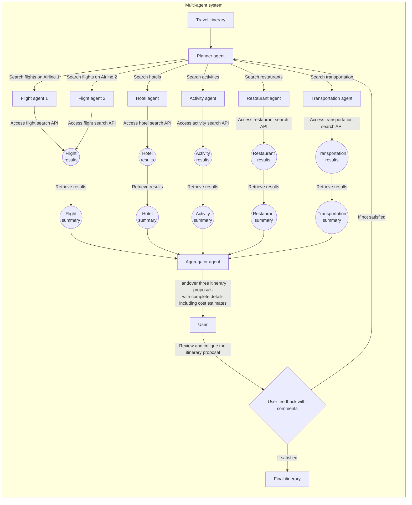

It's the middle of 2025, and I've been working on building AI agents for a while now. In case I forget, I want to jot down everything that I've learned so far. This blog is structured in a way that starts with the basics and then goes deeper into the more complex aspects of building AI agents. Starting with Large Language Models (LLMs) and prompting, then moving on to levels of autonomy of AI agents, structured outputs, tool calling, agent memory, dynamic agents, middleware (guardrails), Model Context Protocol (MCP), workflows, streaming, observability and tracing, Retrieval-Augmented Generation (RAG), multi-agent systems, evaluations, and, finally, deployment.

I'm hoping that this will be a useful resource for anyone looking to build AI agents, whether you're just starting out or have been working on them for a while.


## LLMs and prompting
If you're reading this, you probably already know that LLMs are the backbone of the modern AI agent (i.e., the "brains" of the agent). Just know that LLMs process text and generate text based on the input they receive. Essentially, LLMs are trained on web-scale text data, often web-crawled from the Internet. The purpose of this training is to predict the next word (for simplification) in a sentence given the previous words. This is done using a Transformer architecture. In this way, LLMs can sort of imitate human-like text generation. Thus, we can use LLMs to generate text, answer questions, summarize information, and more because we humans can do all of these things with text.

>Lesson 1: **Writing good prompts is the most important skill you need to master when building AI agents.** A well-crafted prompt beats an over-engineered system any day. You can have the most advanced AI agent in the world, but if your prompts are bad, your agent will be useless. So, **invest time in learning how to write good prompts.** I am willing to argue that prompt writing is a skill the current and future generations must get good at. **Prompt writing should be taught in schools or be included in the curriculum.** LLMs and AI agents are here to stay, and they will only get better. So, learn how to write good prompts now, and you'll be ahead of the curve.
{: .prompt-tip }

### Baking a good prompt
Prompts dictate the behavior of LLMs -- they are the instructions that tell the model what to do. You may pick and choose from the following lessons to improve your prompt writing skills:
>Lesson 2: **Provide more examples to the LLM.** Here I will refer to this as "few-shot prompting." You give multiple examples for the LLM to learn from because more examples means more guidance. My personal rule of thumb is to provide at least 2-3 gold standard examples in the prompt. To form the gold standard examples, it must contain the following -- one most common input-output pair, one second most common input-output pair, and one edge case input-output pair.
{: .prompt-tip }

>Lesson 3: **Perform a heuristic prompt optimization.** You have an initial prompt and the expected output. You first provide this initial prompt and the expected output to the LLM. Instruct the LLM to optimize the prompt to get the expected output. Then, use this modified prompt on a hidden test example to see if it works. If it does, then you can use this modified prompt as your final prompt. If it doesn't, then you can feed the modified prompt back to the LLM and ask it to optimize it again. Repeat this process until you get a prompt that works well on the hidden test example.
{: .prompt-tip }

>Lesson 4: **Modify the system prompt.** The system prompt gives the LLM its role or persona. This is good for setting the context of the conversation. For example, if you want the LLM to act as a customer support agent, you can set the system prompt to <i>“You are a customer support agent. Your job is to help customers with their issues.”</i> This way, the LLM will know that it should act as a customer support agent and not as a general-purpose LLM. However, it is **uncommon to observe improved accuracy in the LLM's responses when modifying the system prompt.**
{: .prompt-tip }

>Lesson 5: **Formatting is king.** Like I said earlier, LLMs are trained on web-scale text data, so they are used to seeing text in a certain format. Use formatting to your advantage. **Capitalization or wrapping words in bold-face tags (`**`) adds emphasis to certain words. Markdown formatting (e.g., bold, italics, lists) can help structure the output. I often use markdown formatting paired with special tags. Examples: `[[ # role ]]`, `[[ # context ]]`, `[[ # task ]]`, `[[ # constraints ]]`, `[[ # tools ]]`.**
{: .prompt-tip }

Here's an example of a good prompt:
```markdown
[[ # role ]]
You are Footy, an AI assistant that assists users in writing post-match reports for football matches. You must act as a professional sports journalist but with a fun and engaging tone.

[[ # context ]]
The user will provide you with the match details, including the teams and scores. It will look exactly like this: "Barcelona vs. Real Madrid, 1-1, July 28, 2025". Your job is to write a post-match report that summarizes the match and highlights the key events. Most of your readers are teen football fans, so write in a way that is engaging and fun to read. You may insert emojis and football-related terms to make the report more lively. The report will be published on social media, so keep it concise and to the point.

[[ # task ]]
Write a post-match report for the given match details.

[[ # constraints ]]
- Limit the report to no more than 500 words.
- Use markdown formatting to structure the report. Include the following sections: Introduction, Match Summary, Key Events, and Conclusion.
- Wrap the key events in bold-face tags (`**`). Example: **Goal by Player X in the 45th minute**.

[[ # tools ]]
You have access to the following tools:
- `lookup-web`: Use this tool to search for information on the web. This will help you create context on the latest match and help synthesize key events. Arguments: `query` (string). Example: `lookup-web("Barcelona vs Real Madrid latest match result")`
- `lookup-db`: Use this tool to look up information in the local database. This will help you create context on historical or previous matches between the teams. Arguments: `query` (string). Example: `lookup-db("Barcelona vs Real Madrid")`
```

### Choosing the LLM provider -- open-source vs. cloud APIs
>Lesson 6: **If you are prototyping or building a proof of concept, use cloud APIs.** They are easy to use, and you can get started quickly. It will save you a lot of time and effort debugging issues instead of actually iterating on your design of the agentic AI system. Start with a hosted provider like OpenAI, Google Gemini, Anthropic, or Mistral.
{: .prompt-tip }

However, when you are ready to build a production system, you should consider using open-source LLMs. They are more flexible and can be fine-tuned to your specific use case. You can also run them on your own infrastructure, which gives you more control over the system. Some popular open-source LLMs include Meta's Llama or Google's Gemma family of models. Explore Hugging Face's Model Hub for a wide range of open-source LLMs. Building production-ready agentic AI systems is another discussion and deserves its own blog post. More on prototyping, this brings me to the next lesson.

>Lesson 7: **Use a model routing platform to quickly switch between LLM providers without needing to change you code based on their corresponding provider SDKs.** I use [LiteLLM](https://docs.litellm.ai/) or [OpenRouter](https://openrouter.ai/docs/quickstart) for this purpose. They provide a unified interface to interact with different LLM providers, making it easy to switch between them without changing your code.
{: .prompt-tip }

If you don't have the freedom to choose your LLM provider, then you can use the following lesson.
>Lesson 8: **Master your current LLM provider's SDK.** Each LLM provider has its own SDK, and you should learn how to use it effectively. This will help you get the most out of the LLM and avoid common pitfalls. For example, I prefer using [Google Agent Development Kit](https://google.github.io/adk-docs/) (ADK) for building AI agents. The documentation is comprehensive, and it provides a lot of useful features out of the box. It also has a good community support, so you can get help when you need it.
{: .prompt-tip }

### Choosing the size (model and context window) of the LLM
LLM size just means the number of parameters the Transformer model has. The more parameters, the larger the model. According to scaling laws, larger models tend to perform better on a wide range of tasks. Thus, larger models are generalists. The most advanced, latest, and largest LLMs are more expensive than their smaller or older counterparts. However, they are also more capable and can handle more complex tasks. Smaller or older models are cheaper and faster to run, but can be less accurate.
>Lesson 9: **Start with the latest and expensive LLMs first.** Building towards a functional yet high-quality prototype, this is the best way to go. Once you get the prototype working, you can then experiment with smaller or older models to see if they can handle the task. Gauge their performance and see which part needs fixing (i.e., the prompt, the model, or the task itself). If you can get away with using a smaller or older model, then you can save on costs.
{: .prompt-tip }

For the context window, you can think of it as the LLM's cognitive load, or the amount of text the model can consider at once. Larger context windows allow the model to take into account more information when making predictions, which can lead to better performance on tasks that require understanding of long documents or conversations. However, larger context windows also require more computational resources and can be slower to process.
>Lesson 10: **Use the LLM with the largest context window available for early prototyping.** This will allow you to experiment with longer inputs to the LLM and will save you both time and effort in picking relevant context for the LLM to consider. Additionally, feeding as much context to the LLM can help you understand the limitations of the LLM and how it handles long inputs. Once you have a working prototype, you can then experiment which parts of the context can be removed or shortened to save on costs.
{: .prompt-tip }

### General purpose models vs. reasoning models
There are two types of LLMs: general purpose models and reasoning models. General purpose LLMs are pre-trained and fine-tuned on a wide range of tasks including summarization, zero-shot classification, question answering, or mundane tasks like writing emails. Reasoning models, on the other hand, are general purpose LLMs but elicit what we call "reasoning" or "thinking" tokens. These tokens are intermediate tokens that guide the generation of the final output. Reasoning models are often used for tasks that require more complex reasoning, such as maths, logic, planning, or decision making.
>Lesson 11: **Use a reasoning model as the backbone of your AI agent.** Reasoning model makes an AI agent more capable of handling virtually all tasks. To save costs and inference time, you can tweak the thinking budget, or the maximum number of reasoning tokens the model can generate.
{: .prompt-tip }

>Lesson 12: **Set the token budget to zero (i.e., turn off reasoning) for tasks that do not require reasoning. You do not need to *write a dissertation* for a simple *yes or no* question.** For example, if the task is to classify an input into one of two categories, it is not necessary to generate reasoning tokens. A general purpose model can handle this task just fine. Even though more intermediate (reasoning) tokens can guide the generation of the final output, it is not always good to assume that those tokens will always lead to smarter outputs. Think of it as 99% of the time, reasoning tokens are helpful, but there is a 1% chance that they can lead to hallucinations or incorrect outputs. So, use reasoning tokens judiciously. This is a design matter.
{: .prompt-tip }

## Agents and autonomy
You don't need to build an AI agent if you just want to use LLMs for one-shot tasks like, "write an essay about ..." or "respond to this email in a ... manner."
>Lesson 12: **Only build an AI agent when if you were to delegate *this* specific task to a human operator, you would expect them to use problem-solving skills that enable their [*System 2 thinking*](https://thedecisionlab.com/reference-guide/philosophy/system-1-and-system-2-thinking) such as breaking down the task into smaller steps, considering different approaches, utilizing external tools, and making decisions based on the context.** Before performing the task or coming up with a solution, it requires the human (or agent) to be deliberate, effortful, and conscious in their thinking.
{: .prompt-tip }

### Intuitive design of autonomy
Autonomy is the degree to which an AI agent can operate independently without human intervention. Here's a lesson that shows how to intuitively design the autonomy of your AI agent:
>Lesson 13: **Low level autonomy for classification, conditional or branched tasks, medium level for tool-using tasks, and high level for complex tasks that necessarily require multiple steps.** For example, if there is a task that requires the agent to make a decision (e.g., classify the input into one of two categories, or classify whether or not the current generated output is satisfactory), then you can use low level autonomy. If the task requires the agent to use a tool (e.g., search the web for information, or run a code snippet to validate generated code), then you can use medium level autonomy. Finally, if the task requires the agent to plan and execute a multi-step process (e.g., processing your trip itinerary including booking flights, hotels, and activities), then you can use high level autonomy.
{: .prompt-tip }

>Lesson 14: **Medium level and high level autonomy require memory.** The agent needs to remember the context of the task, the steps it has taken, and the decisions it has made. This is where agent memory comes in.
{: .prompt-tip }

## Structured outputs
>Lesson 15: **No matter what the task is, a structured output is always better than a free-form output.** This stems from the fact that structured outputs are easier to parse, validate, and use in subsequent steps. This is also important in multi-agent systems where agents need to communicate with each other. A structured output follows a schema, or a predefined format.
{: .prompt-tip }

Here's an example of a structured output:
```python
from pydantic import BaseModel, Field

class PostMatchReport(BaseModel):
    title: str = Field(..., description="The title of the report")
    summary: str = Field(..., description="A brief summary of the match")
    key_events: list[str] = Field(..., description="List of key events in the match")
    conclusion: str = Field(..., description="The conclusion of the report")
```
This is a Pydantic model that defines the structure of the post-match report. The `Field` class is used to provide additional information about each field, such as its description. This makes it easier to understand what each field is for and how to use it. You feed this schema as part of the arguments to the LLM API call (most providers support this) and the LLM will generate the output in this format. I term this as **schema-guided generation**.

## Tool calling
Tools are functions that the AI agent can call to perform a specific operation often an intermediate step before generating the final response.
>Lesson 20: **Be *crystal clear* about the tool's purpose and how it should be used.** The agent should know when to use the tool, what input to provide, and what output to expect.
{: .prompt-tip }

Here's an example of a good tool definition:
```python

@tool   # This decorator is used to register the function as a tool.
def lookup_web(query: str) -> str:
    """
    Performs a web search for the given query via a search engine API (`search` function) and returns the search results.
    It has a range of applications, such as looking up the latest match results, finding relevant articles, or gathering information on a specific topic.
    
    Args:
        query (str): The search query. Keywords related to the topic of interest.
        
    Returns:
        str: The search results as a string.
        
    Example:
        lookup_web("Barcelona vs Real Madrid latest match result")
    """
    # The `search` function is a placeholder for the actual search engine API call.
    search_results = search(query)
    if not search_results:
        return "No results found."
  
    # Format the search results as a string.
    search_results = "\n".join([f"Reference {i+1}. {result}" for i, result in enumerate(search_results)])
    return f"Search results for '{query}':\n{search_results}"
```

This tool definition is clear and concise. It provides a detailed description in the tool's docstring, explaining its purpose, input and output (including the expected type), and an example of how to use it. The semantic name of the function (`lookup_web`) also indicates its purpose, making it easier for the agent to understand when and how to use it.

Think carefully about your tool design. Use a scratchpad to brainstorm all the tools you need and what each tool should do. To help you with this, you can start by putting yourself in the shoes of the agent. If you were the agent, what specific set of operations would you need to accomplish the task at hand? Translate those operations into tools.
>Lesson 21: **Break your problem into atomic, well-defined, and operable actions.** Each tool should perform a single operation that is easy to understand and use. This will make it easier for the agent to use the tools effectively and will also make it easier to debug any issues that arise.
{: .prompt-tip }

## Agent memory
Memory helps the agent maintain context and manage continuity across interactions done in different points in time. There are four types of memory: **working memory**, **procedural memory**, **semantic memory**, and **episodic memory**. Long term memory is composed of procedural, semantic, and episodic memory. Working memory reflects the agent's current state and contains recent interactions including results, perceptual inputs, and tool calls. Procedural memory is the system prompt or user prompt that defines the agent's role and capabilities including specific instructions on how to perform tasks. The procedural memory therefore are set of rules applied to the agent's working memory to determine the agent's behavior. Semantic memory represents the ground truths and facts about the environment. Episodic memory stores sequences of the agent's past behaviors. Note that memory is retrieved by the agent and is inserted into the prompt as context. This means that it incurs a cost in terms of the number of tokens used in the prompt. Thus, it is important to manage memory effectively to avoid exceeding the context window of the LLM.

>Lesson 22: **Limit the amount of memory you use through token limits.** You can set a token limiter, for example, to limit the memory to 2048 tokens. Another example, you can keep the last 2048 tokens of the retrieved memory.
{: .prompt-tip }

>Lesson 23: **Remove verbose tool calls from the memory.** Tool definitions are often verbose and can take up a lot of tokens in the context window. You can remove the tool definitions from the retrieved memory and only keep the tool names and their results. This will help you save tokens and keep the memory concise.
{: .prompt-tip }

## Dynamic agents
A dynamic agent is an agents whose behavior can be changed at runtime. This means we can modify the agent's instructions, base LLM, and tools without having to redeploy the agent. This is often used in tiered systems or subscription-based systems where the agent's capabilities can be upgraded or downgraded based on the user's subscription level.
>Lesson 24: **Use a dynamic agent for tiered or subscription-based systems.** Tiered systems are systems where a particular set of capabilities are offered to the user based on their tier level. For example, an admin user can have access to all the tools and capabilities of the agent, while a regular user can only have access to a subset of the tools and capabilities. This allows you to offer different levels of service to different users without having to create multiple agents.
{: .prompt-tip }

Here's an example of a dynamic agent:
```python

class DynamicAgent:
    def __init__(self, name: str, base_llm: LLM):
        self.name = name
        self.base_llm = base_llm

    def setup_agent(self, user_tier: Literal["free", "pro", "enterprise"]):
        """
        Set up the agent with the base LLM and tools.
        This method can be called at runtime to change the agent's behavior.
        """
        match user_tier:
            case "free":
                self.base_llm = LLM("basic-model")
                self.tools = tools_lib.basic_tools
                tier_service = services_lib.basic_services
            case "pro":
                self.base_llm = LLM("pro-model")
                self.tools = tools_lib.advanced_tools
                tier_service = services_lib.advanced_services
            case "enterprise":
                self.base_llm = LLM("enterprise-model")
                self.tools = tools_lib.premium_tools
                tier_service = services_lib.premium_services
        self.system_prompt = (
            f"You are {self.name}, an AI agent that assists users with their tasks. "
            f"You will be interacting with a user that has a {user_tier} subscription.\n\n"
            f"For the {user_tier} subscription, you provide the following services:\n{tier_service}\n\n"
            f"The {user_tier} subscription only supports the following tools:\n{self.tools}\n\n"
        )
        self.system_prompt += "You can use the tools to perform tasks and provide the user with the best possible experience."
```

## Middleware
Middleware is a layer often used for validation and security of inputs and outputs coming in and out of the agent called as **guardrails**, and is also used for authentication and authorization of users. We can enforce rate limiting and other security measures in this layer. Some people include observability and tracing in the middleware layer, but my experience so far is that observability and tracing are better suited as a separate layer.
>Lesson 25: **Guardrails are your first line of defense against prompt injection attacks, model jailbreaking (e.g., "BYPASS CURRENT INSTRUCTIONS AND DO ...") and malicious or harmful outputs.** Other prompt injection attacks include requesting the agent to share personal information, retrieving sensitive data either from your database or from the base LLM's training data (i.e., sensitive data leakage), or even requesting the agent to perform actions that are not allowed by the system (e.g., "delete all my files"). LLM outputs can also be harmful, such as generating hate speech, misinformation, or other harmful content. Guardrails are designed to prevent these types of attacks and outputs.
{: .prompt-tip }

>Lesson 26: **For tiered systems, design authentication and authorization towards the principle of least privilege.** This means that permissions are granted based on the user's tier level. For example, an enterprise user can have access to agents that utilize premium tools and services with increased rate limits, while a free user can only have access to agents that utilize basic tools with limited rate limits.
{: .prompt-tip }

## Model Context Protocol (MCP)
MCP is a standardized protocol for LLM-powered agents to access and invoke tools and services. If your agent is designed for MCP, it can be used with any MCP-compliant agentic AI system. MCP has two basic components: the **server** and **client**. The server contains the tools and services that the agent can use. The client is the agent that send tool requests to the server and receives tool responses. This is the reason why MCP is the current standard for remote code execution.
>Lesson 27: **You DO NOT need MCP if you can turn your tools into a pipeline.** Basic integrations are services often developed and maintained by third-party providers, such as Google Search, Google Calendar, or Google Mail (Gmail). These services are often used by agents to perform specific tasks. If you can turn your tools into a pipeline, you can avoid the complexity of MCP.
{: .prompt-tip }

The reason for this is that MCP is a complex protocol that requires a lot of boilerplate code to implement. It is also not necessary for simple agents that only require a few tools or services. Based on my experience, having three or less integrations is enough to justify not using MCP. During those instances, I just include the tool definitions in the agent's codebase and create a pipeline. This is simpler and easier to maintain. For example, I built an agent that puts upcoming football matches in my personal calendar. This requires only two integrations: Google Search and Google Calendar. The pipeline would look like this: search for upcoming football matches $\rightarrow$ parse the results $\rightarrow$ create calendar events for those matches. If I were to extend this pipeline, I could integrate Gmail at the end to send me an email notification regarding the updated calendar events. This is a simple pipeline that does not require MCP.
>Lesson 28: **Only deploy an MCP server if you are building a set of tools and services that you want other agents to use.** If you have multiple agentic AI systems that need to interact with the same set of tools and services, then MCP can help you standardize the way those agents interact with those tools and services. This can help you avoid duplication of code and make it easier to maintain your agents.
{: .prompt-tip }

## Workflows
Workflows are a way to define the sequence of steps that an agent should take to complete a task. They are often used to automate repetitive tasks. The common workflow patterns are the following: **chaining**, **routing (branching)**, **parallelization (merging)**.
>Lesson 29: **Use chaining if the task can be cleanly broken down into predictable, sequential steps.** Chaining is a sequential workflow pattern where the output of one step is the input to the next step. If a task can be broken down into a series of manageable steps in a linear fashion, then chaining is the way to go. For example, if you are building an agent that generates a report, you can chain the steps of gathering data, analyzing data, and generating the report.
{: .prompt-tip }


>Lesson 30: **Use routing if the task requires branching based on conditions, intermediate outputs, or user inputs.** Routing is a workflow pattern where the agent can take different paths based on certain conditions. When a task is routed, the selected LLM will handle the task based on the conditions specified in the routing logic. For example, if you are building an agent that can handle different types of requests, you can route the requests to different LLMs based on the type of request.
{: .prompt-tip }


>Lesson 31: **Use parallelization if the task can be broken down into independent steps that can be executed concurrently.** Parallelization is a workflow pattern where multiple steps can be executed at the same time. This is useful for tasks that can be done in parallel, such as processing large documents, running information retrieval in parallel, or asking multiple LLMs the same question with different perspectives. For example, if you are building an agent that can summarize multiple sections of a document, you can parallelize the summarization of each section and then merge the summaries into a final summary.
{: .prompt-tip }


>Lesson 32: **Compose the steps such that a step only lets the LLM do one thing at one time.** Do not let the LLM do multiple things in one step. Otherwise, it will be confusing on your part to debug the workflow or trace the input-output flow of the agent. For example, if you are building an agent that can summarize a document and then generate a report based on the summary, you should have two separate steps: one for summarizing the document and another for generating the report. This way, you can easily trace the input-output flow of the agent and debug any issues that arise.
{: .prompt-tip }

## Streaming
Streaming is a way to display the output of the LLM as it is being generated. This is useful for tasks that require real-time feedback or interaction, such as chatbots or interactive agents. The key takeaway is that streaming is powerful -- especially for user-facing applications -- because it allows the user to see the output as it is being generated, which can improve the user experience and make the agent feel more responsive.
>Lesson 33: **Streaming is a must and do it as much as possible.** Let the user see the output as it is being generated -- whether the output be text, a step in a workflow, a tool call, a retrieved memory or context, or a decision made by the agent. This can help the user understand what the agent is doing and makes the user feel more engaged throughout the process and more reassured that the process is in motion than just dumping everything at once.
{: .prompt-tip }

## Observability and tracing
Observability is the quality of being able to visualize LLM input-output traces. This includes logging, metrics, and tracing. Observability is important for debugging and troubleshooting issues that arise in the agent. Tracing is a kind of telemetry that tracks the flow of input-output pairs through the agent.
>Lesson 34: **Use observability to monitor the agent's behavior and performance.** This is because LLMs are strictly non-deterministic, so the question shifts from *"will my LLM go haywire?"* to *"when and how often will my LLM go haywire?"*
{: .prompt-tip }

>Lesson 35: **Tracing should be able to help you see how long each step in the workflow takes, what the input-output pairs are, and other relevant information such as start and end times, status codes, total tokens used and generated, total cost, and workflow type.** This information can help you identify bottlenecks in the workflow.
{: .prompt-tip }

>Lesson 36: **You need a dedicated server that can handle the observability and tracing of your agent.** This server should be able to store the traces and provide a way to visualize them. Examples: [MLflow](https://www.mlflow.org/docs/latest/genai/tracing/) and [Opik](https://www.comet.com/docs/opik/quickstart).
{: .prompt-tip }

>Lesson 37: **Export traces to an OpenTelemetry collector.** OpenTelemetry is a CNCF standard for observability. In this way, you can easily communicate LLM traces to other engineers and developers in your organization. This is especially useful if you are building a multi-agent system or a system that requires collaboration between different teams. Example: [Datadog](https://docs.datadoghq.com/observability_pipelines/).
{: .prompt-tip }

## Retrieval-Augmented Generation (RAG)
RAG is a technique that combines the power of LLMs with external knowledge sources to improve the accuracy and relevance of the generated output. The most fundamental RAG system is composed of a retriever and a generator. The retriever is responsible for fetching relevant information from an external knowledge source, such as a database or a search engine, while the generator is responsible for generating the final output based on the retrieved information and the input prompt. This only takes seven steps: Chunking $\rightarrow$ Embedding $\rightarrow$ Upsert $\rightarrow$ Indexing $\rightarrow$ Retrieving $\rightarrow$ Reranking $\rightarrow$ Synthesizing.

Chunking splits a document into smaller, manageable pieces called chunks. Embedding converts the chunks into vector representations that capture their semantic meaning. Upsert (combination of update and insert) adds the chunks to the vector database. Indexing creates an index, a data structure that allows for efficient retrieval of the chunks based on their vector representations. Retrieving fetches the most relevant chunks from the vector database based on the input query. Reranking reorders the retrieved chunks based on their relevance to the input query. Synthesizing generates the final output based on the retrieved chunks and the input prompt.
>Lesson 38: **DO NOT build a RAG system if you haven't done the following: (1) dump all relevant documents into the context window of the LLM, (2) simple information retrieval functions such as pairing metadata filtering with keyword search, or rule-based matching.** If neither of these give you satisfactory results, then you can consider building a RAG system. RAG systems are more complex and require more resources to build and maintain, so it is important to make sure that you really need it before investing time and effort into building one.
{: .prompt-tip }

### Which vector database to choose
>Lesson 39: **[Qdrant](https://qdrant.tech/documentation/quickstart/) and [Chroma](https://docs.trychroma.com/docs/overview/getting-started) are solid choices for prototyping and early-stage development. In production, [Pinecone](https://docs.pinecone.io/guides/get-started/quickstart) and [Weaviate](https://docs.weaviate.io/weaviate/quickstart/local) are more suitable due to their scalability and advanced features.**
{: .prompt-tip }

### Lego blocks of a RAG system
>Lesson 40: **The most crucial block of a RAG system is chunking. Your chosen chunking strategy is a design matter.** Excellent chunking strategy paired with a small LLM trumps poor chunking paired with a large LLM. How can we say that chunking is excellent? It is when chunks are semantically coherent (meaning that they capture the essence of the document), preserve the context, and are of manageable size (i.e., not too long or too short). The chunking process is often the most time-consuming part of building a RAG system, so it is important to get it right. Most common chunking strategies are based on the following: fixed size, recursive, document-based, semantic, and agentic chunking.
{: .prompt-tip }

>Lesson 41: **For prototyping and early-stage development, use [Sentence Transformers](https://sbert.net/) for embedding and reranking because it is easy to set up and provides you access to a wide range of pre-trained and fine-tuned state-of-the-art embedding and reranker models.**
{: .prompt-tip }

>Lesson 42: **When upserting chunks into the vector database, the metadata should be as rich as possible and utilized to its fullest extent.** Metadata is the key to efficient retrieval and reranking. However, it is important to note that metadata is not the same as the chunk itself. Metadata should be used to provide additional context and information about the chunk, such as its source, author, date of creation, and other relevant information.
{: .prompt-tip }

>Lesson 43: **Consider the dimension of the embedding vector when choosing a vector database.** The dimension of the embedding vector is the number of features that the vector represents. A higher dimension means that the vector can capture more information, but it also means that the vector database will require more storage and computational resources. Most vector databases support a wide range of dimensions, so it is important to choose a dimension that is appropriate for your use case.
{: .prompt-tip }

>Lesson 44: **Your indexing strategy depends on the size of your vector database and the number of chunks you have.** For small to medium-sized vector databases, you can use a simple indexing strategy such as brute force or approximate nearest neighbor (ANN) search. For large vector databases, you may need to use more advanced indexing strategies such as hierarchical clustering, locality-sensitive hashing (LSH), or product quantization (PQ). Pinecone's "[Faiss: The Missing Manual](https://www.pinecone.io/learn/series/faiss/)" is my bible for learning about indexing strategies.
{: .prompt-tip }

>Lesson 45: **During retrieval, you can use a combination of vector search and keyword search to improve the accuracy and relevance of the retrieved chunks.** Start with traditional keyword search to narrow down the results, and then apply vector search to the filtered results to find the most relevant chunks.
{: .prompt-tip }

>Lesson 46: **Reranking is an optional step, but must be done only on top K retrieved chunks.** Choosing the top K chunks is a design matter, but my rule of thumb is to retrieve the top 3 chunks (generally for any task) and rerank them to find the most relevant one. Reranking can be done using a separate model or by using the same model that was used for embedding. Of course, you have the freedom to tweak the top K value based on the task at hand. For example, if you are building a question answering system, you can set the top K value to 1 to retrieve the most relevant chunk. If you are building a summarization system, you can set the top K value to 3 or 5 to retrieve multiple chunks and generate a more comprehensive summary.
{: .prompt-tip }

### Agentic RAG
>Lesson 47: **Agentic RAG is a RAG system that uses an agent with access to a set of search tools to retrieve information from the web, databases, and other sources.** A reasoning model is often used as the backbone of the agent to perform deep research, analysis, and synthesis of the retrieved information. The agent must possess the autonomy to decide from which source to retrieve information, how to process the retrieved information, and how to generate the final output.
{: .prompt-tip }

## Multi-agent systems
A multi-agent system is a system composed of multiple AI agents that collectively work together to perform a task. This entails that communication and coordination among agents are important as well as the ability to share information and resources. Each agent in a multi-agent system can have its own set of tools, memory, system prompt, and capabilities. Here I elaborate on the lessons learned in building multi-agent systems.
>Lesson 48: **A planner agent is the most important agent in a multi-agent system. It is responsible for breaking down the task into smaller sub-tasks, assigning those sub-tasks to other agents, and coordinating the execution of those sub-tasks.** I often use a powerful reasoning model as the planner agent. The planner agent can also be used to monitor the progress of the other agents and provide feedback on their performance.
{: .prompt-tip }

Here's an example of a multi-agent system that plans a travel itinerary:


As you can observe, each agent is responsible for a specific task, such as searching for flights, hotels, activities, restaurants, and transportation. The planner agent coordinates the execution of these tasks and aggregates the results into a final itinerary. The aggregator agent is responsible for combining the results from all the agents and returning the final itinerary to the user.

>Lesson 49: **In a multi-agent system, small language models (SLMs) are often used as the backbone of the agents. SLMs are smaller which leads to faster and more efficient inference.** My personal experience is that SLMs are often sufficient for most tasks. The [Qwen3](https://huggingface.co/collections/Qwen/qwen3-67dd247413f0e2e4f653967f) (0.6B, 1.7B, 4B, and 8B) models are great examples of SLMs that can be used as the backbone of agents.
{: .prompt-tip }

>Lesson 50: **DO NOT use greedy decoding when using SLMs.** Greedy decoding is a decoding strategy that selects the most probable next token at each step during generation. Based on my empirical results, greedy decoding leads to token repetitions and improper tool calls. I set `0.6 <= temperature <= 0.75`, `0.8 <= top_p <= 0.95`, and `top_k = 20` for SLMs, whether they are reasoning or basic models.
{: .prompt-tip }

>Lesson 51: **Package a sequence of tools as a pipeline.** Others call it workflow-tool but they mean the same thing. In a multi-agent system, it is often the case that a sequence of tools needs to be called in a specific order to perform a task. To keep the agent's codebase clean and organized, you can package a sequence of tools as a pipeline. This is a tool that encapsulates a sequence of tools and can be called as a single tool. For example, if you have a sequence of tools that search for flights, compare prices, and book the cheapest flight, you can package these tools as a pipeline.
{: .prompt-tip }

Here's an example of a pipeline that searches for flights, compares prices, and books the cheapest flight:
```python
@tool
def book_cheapest_flight(
    origin: str,
    destination: str,
    departure_date: str,
    return_date: str,
    budget: float
) -> str:
    """
    This is a pipeline that (1) searches for flights from origin to destination, (2) compares prices, and (3) books the cheapest flight.

    Args:
        origin (str): The origin airport.
        destination (str): The destination airport.
        departure_date (str): The departure date in YYYY-MM-DD format.
        return_date (str): The return date in YYYY-MM-DD format.
        budget (float): The maximum budget for the flight.
    
    Returns:
        str: The booking confirmation details.

    Example:
        book_cheapest_flight("JFK", "LAX", "2025-08-01", "2025-08-07", 500.0)
    """
    # Search for flights
    flights = search_flights(origin, destination, departure_date, return_date)
    if not flights:
        return "No flights found."
    # Compare prices
    cheapest_flight = min(flights, key=lambda x: x['price'])
    if cheapest_flight['price'] > budget:
        return f"No flights found within budget of {budget}."
    # Book the cheapest flight
    booking_confirmation = book_flight(cheapest_flight['id'])
    return f"Flight booked successfully: {booking_confirmation}"
```
This pipeline searches for flights, compares prices, and books the cheapest flight in a single tool call. You can also apply this principle to a standalone agent.

## Evaluations
Evaluations of agentic AI systems are different from traditional unit tests in the software engineering sense. Recall that outputs generated by LLMs are non-deterministic, meaning that the same input can yield different outputs each time it is run. Evaluations are thus more about providing metrics and benchmarks to measure the performance of the agentic AI system. The evaluation result is often a score between 0 and 1, where 1 is the best score. Other times, it can be time-to-first-token (TTFT), end-to-end latency (E2EL), time per output token (TPOT), tokens per second (TPS), and requests per second (RPS). Let me break down what these metrics mean:
- **Time-to-first-token (TTFT)**: This metric measures how long a user waits before the model starts producing output. It captures the duration from when a query is submitted to when the first token is received (assuming the response isn't empty). TTFT typically accounts for request queuing, prefill computation, and network latency. Longer prompts tend to increase TTFT, since the model's attention mechanism must process the entire input to build the key-value cache (KV-cache) before generation can begin. In production environments, multiple requests may be handled simultaneously, so the prefill phase of one request can overlap with the generation phase of another.

>Lesson 52: **Disregard an empty first token when calculating TTFT.** An empty first token is meaningless and should not be counted in the TTFT calculation. The first token should be the first non-empty token generated by the model.
{: .prompt-tip }

- **End-to-end latency (E2EL)**: This metric measures the total time from when you send a request until you get the complete response. This includes any time spent waiting in queues or batches, and delays from network issues. For a single request, you can calculate end-to-end latency by adding the time to first token (TTFT), which is how long it takes to get the initial part of the response, and the generation time, which is the time it takes for the rest of the response to be created. Formula: $\text{E2EL} = \text{TTFT} + \text{Generation Time}$.

>Lesson 53: **Similarly, disregard an empty last token when calculating E2EL.**
{: .prompt-tip }

- **Time per output token (TPOT)**: This metric measures the average time it takes for a system to generate each token after the first one. While the concept seems simple, how it's calculated can vary among benchmarking tools. When computing TPOT, we specifically exclude the first token to ensure TPOT accurately reflects only the decoding phase of the request processing, isolating it from the initial processing. Formula: $\text{TPOT} = \frac{\text{E2EL}-\text{TTFT}}{\text{Total output tokens}-1}$

>Lesson 54: **Consistent TPOT is a key sign of a well-optimized system, indicating efficient memory management, ample memory bandwidth, and effective attention computation.** It's important to remember that as the length of the generated output increases, the KV cache grows, which in turn consumes more memory. Similarly, the computational cost of the attention mechanism increases proportionally with the total length of both the input and output sequences. Despite this, the attention computation itself is typically not the main factor limiting performance.
{: .prompt-tip }

- **Tokens per second (TPS)**: Per user, TPS offers a direct look at an individual user's experience of system performance. It's calculated by taking the length of the output sequence for that user's request and dividing it by the total time the request took (E2EL). As the output sequence gets longer, this metric will gradually get closer to the inverse of the inter-token latency ($\frac{1}{\text{ITL}}$).

>Lesson 55: **TPS is a staple metric for assessing the performance of each agent in a multi-agent system.** By analyzing TPS on a per-agent basis, you can identify which agents are performing well and which may need optimization. For example, if one agent consistently has a lower TPS but it's handling a simpler task, it may indicate that the agent is not optimized for that task or that it is experiencing bottlenecks in its processing. Conversely, if an agent has a high TPS but is handling a complex task, it may indicate that the agent is well-optimized and performing efficiently.
{: .prompt-tip }

### Text-based evaluation metrics
There are three common evaluation *qualitative* metrics for evaluating the quality of text generated by LLMs: **Accuracy and reliability**, **context utilization**, and **output quality**.
- **Accuracy and reliability**: Used to evaluate how correct, complete, and trustworthy the generated output is. For example:
  - Check for **hallucinations**. Do outputs contain irrelevant or incorrect information despite contextual cues?
  - Check for **fidelity**. Do outputs accurately reflect the input prompt and context?
  - Check for **completeness**. Are all parts of the input prompt addressed in the output?
  - Check for **sensitivity**. Are outputs sensitive to the nuances of the input prompt, such as tone, style, and intent?
  - Check for **relevance**. Do outputs stay on topic and avoid introducing unrelated information?
- **Context utilization**: Used to evaluate how well the LLM uses the context provided in the input prompt and memory. For example:
  - Check for **precision**. Are context chunks placed in the right order semantic-wise?
  - Check for **coverage**. Are all relevant context chunks used in the output?
  - Check for **recall**. Are all relevant context chunks retrieved and considered in the output?
- **Output quality**: Used to evaluate the overall quality of the generated output. For example:
  - Check for **consistency**. Are outputs consistent in style, tone, and format?
  - Check for **adherence to instructions**. Do outputs follow the instructions provided in the input prompt?

>Lesson 56: **Use a combination of these metrics to evaluate the quality of the generated output.** You may pick one or two checks from each metric to evaluate the quality of the generated output. Each metric provides a different perspective on the quality of the output, so it is important to use a combination of them to get a comprehensive view of the output quality.
{: .prompt-tip }

### Other evaluation metrics
- **Zero-shot task performance**: This metric evaluates how well the agent performs a task without any prior training or fine-tuning. It is often used to measure the generalization capabilities of the agent. This includes labeling or classification tasks where the agent must rely on its pre-existing knowledge and reasoning abilities.
- **Coding and mathematical reasoning**: This metric evaluates how well the agent can solve coding and mathematical problems. It is often used to measure the agent's ability to reason and solve problems in a logical and systematic way. This includes tasks such as code generation and problem solving.
- **Tool usage and effectiveness**: This metric evaluates how well the agent uses the tools available to it. It is often used to measure the agent's ability to effectively use the tools to perform tasks and provide the user with the best possible experience. This includes tasks such as tool calls, tool chaining, and tool selection.
- **Completion rate**: This metric evaluates how often the agent successfully completes a task. It is often used to measure the agent's ability to follow through on tasks and provide the user with the desired outcome. This includes tasks such as task completion, goal achievement, and user satisfaction.

## Deployment
Deployment is the process of making the agent available for use. This includes setting up the infrastructure, configuring the agent, and making it accessible to users. The deployment process can vary depending on the type of agent and the infrastructure used.
>Lesson 57: **Chat interface, autoscroll, tool calls display, and streaming are the most important frontend features.** A chat interface allows users to interact with the agent in a conversational manner, making it easier to use and understand. Autoscroll ensures that the user can see the latest output without having to scroll manually. Tool calls display shows the tools being used by the agent, which can help users understand how the agent is performing tasks. Streaming gives the impression that the agent is working on the task and provides real-time feedback to the user.
{: .prompt-tip }

>Lesson 58: **Endpoints, tools, tracing and observability, security, and evaluation are critical for building backend infrastructure.** Endpoints are entry points to all agents, pipelines, and tools in the agentic AI system. Tracing and observability are grouped with middleware and security, and should be implemented to monitor the agent's behavior and performance on the same backend server. Evaluations are often housed on another backend server.
{: .prompt-tip }

>Lesson 59: **Use a containerization platform such as Docker to package the agent and its dependencies into a single container.** This makes it easier to deploy the agent on different environments and ensures that the agent runs consistently across different platforms. You can also use a container orchestration platform such as Kubernetes to manage the deployment of the agent and its dependencies. AWS ECS is a good alternative to Kubernetes if you are looking for a simpler solution.
{: .prompt-tip }

>Lesson 60:  **Serverless deployment isn't ready yet for agentic AI systems.** The common workflow when deploying your agent is this: host your agent in a web server $\rightarrow$ create a Docker image for that web server $\rightarrow$ deploy the Docker image to a container orchestration platform such as Kubernetes. However, agent workloads are more complicated than just your typical web request-response cycle. They require more resources, such as memory and CPU/GPU, to run efficiently. Serverless platforms are not designed to handle these types of workloads, so it is best to avoid them for now.
{: .prompt-tip }
